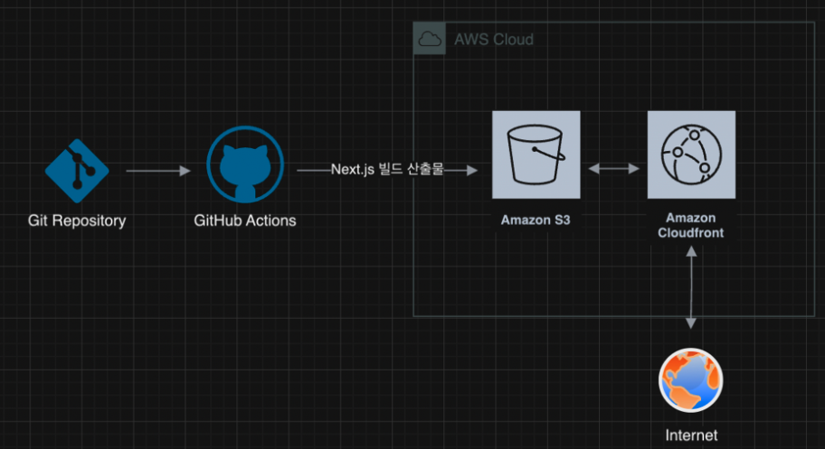

GitHub Actions에 워크플로우를 작성해 다음과 같이 배포가 진행되도록 함

1. 저장소를 체크아웃합니다.
2. Node.js 18.x 버전을 설정합니다.
3. 프로젝트 의존성을 설치합니다.
4. Next.js 프로젝트를 빌드합니다.
5. AWS 자격 증명을 구성합니다.
6. 빌드된 파일을 S3 버킷에 동기화합니다.
7. CloudFront 캐시를 무효화합니다.

## 주요 링크

- S3 버킷 웹사이트 엔드포인트: http://ohayo-bucket.s3-website.ap-northeast-2.amazonaws.com
- CloudFrount 배포 도메인 이름: https://d794thq1r70xs.cloudfront.net

## 주요 개념

- GitHub Actions과 CI/CD 도구: GitHub에서 제공하는 자동화 도구로, 코드 변경 시 자동으로 빌드, 테스트, 배포를 수행합니다.
- S3와 스토리지: Amazon S3는 확장 가능한 클라우드 스토리지 서비스로, 정적 웹사이트 호스팅에 사용될 수 있습니다.
- CloudFront와 CDN: Amazon CloudFront는 전 세계 엣지 로케이션을 통해 콘텐츠를 빠르게 전달하는 CDN 서비스입니다.
- 캐시 무효화(Cache Invalidation): CDN의 캐시된 콘텐츠를 강제로 업데이트하여 최신 버전을 제공하는 프로세스입니다.

- Repository secret과 환경변수: GitHub에서 민감한 정보를 안전하게 저장하고 워크플로우에서 사용할 수 있게 하는 기능입니다.
